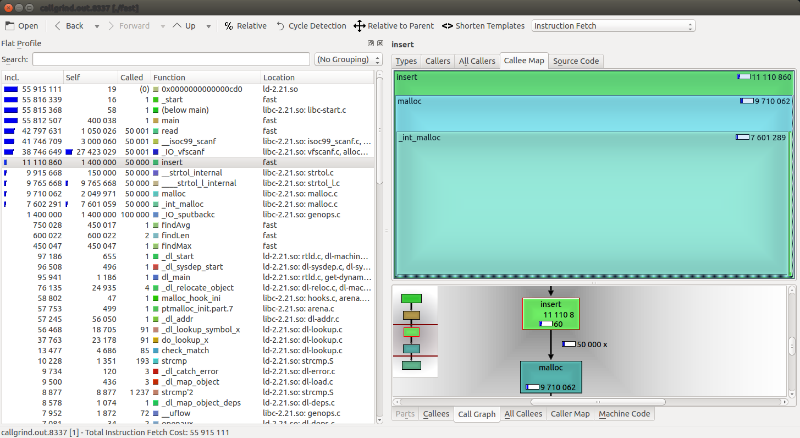
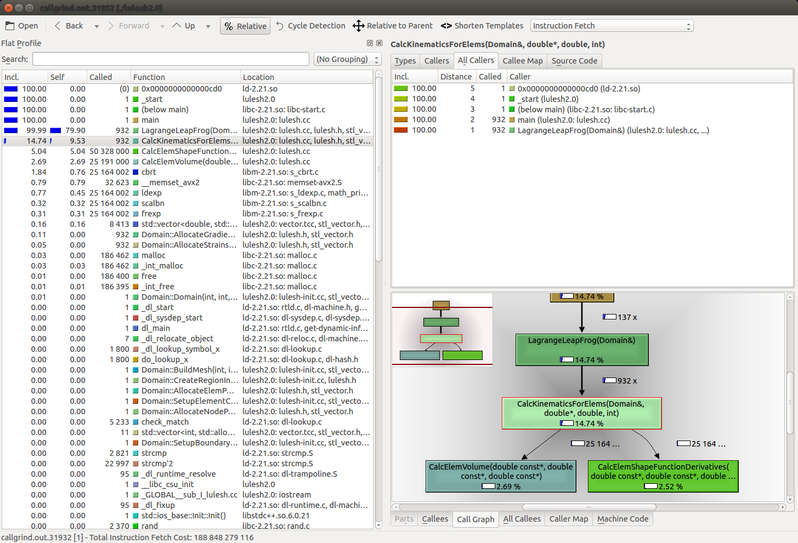

<h1> CS553 Assignment 3: Compiler Tool Demonstration </h1>

<h2> An Introduction to kcachegrind </h2>
In this tutorial you will learn about the profiling visualization tool kcachgrind. This is a profiling tool that can help the user detect bottlenecks in their code. It does this through a GUI that displays myriads of information to the user. It shows things like which functions are running the most, how many instructions are being executed in functions, and a callgraph visualizations. These will hopefully lead the user to conclusions on how to optimize their code. You can find the website for the tool [here](https://kcachegrind.github.io/html/Home.html).


When you develop a program, usually, one of the last steps is to make it as fast as possible (but still correct). You don't want to waste your time optimizing functions rarely used. So you need to know in what parts of your program most of the time is spent. This is done with a technique called Profiling. The program is run under control of a profiling tool, which gives you the time distribution among executed functions in the run. After examination of the program's profile, you hopefully know where to optimize. This tool, kcachegrind, looks to ease the process of finding where to optimize your programs.

<h2> What are callgrind and kcachegrind? </h2>
As stated earlier, kcachegrind visualizes profiling information. The profiling information it uses is generated using the callgrind tool, which uses the valgrind runtime framework and extends the cachegrind tool in order to create call graphs. Essentially, Cachegrind collects flat profile data: event counts (data reads, cache misses, etc.) are attributed directly to the function they occurred in. Callgrind then extends this functionality by propagating costs across function call boundaries. If function foo calls bar, the costs from bar are added into foo's costs. When applied to the program as a whole, this builds up a picture of so called inclusive costs, that is, where the cost of each function includes the costs of all functions it called, directly or indirectly.

<h2> Evaluating a Program Using kcachegrind</h2>
You will find two example files, slow.c and fast.c. We will be running our example on these files. Lets get started.


1. First, make sure you have valgrind installed. You can check if you have valgrind installed by running the command 
```
valgrind --version
```
 If it is uninstalled, you can install it via sudo apt-get install valgrind or by following instructions found [here](http://valgrind.org/downloads/current.html#current).


2. Next, you must install kcachegrind. You can check if you have kcachegrind installed by running the command 
```
kcachegrind --version
```
 If it is uninstalled, you can install it via sudo apt-get install kcachegrindgrind or by following instructions found [here](https://kcachegrind.github.io/html/Download.html).


3. Now we compile our code. We run the following commands (Note the -g option for additional debug information)
```
gcc -g slow.c -o slow
gcc -g fast.c -o fast
``` 
 We now have produced two executables.
 
 
 4. Now we must generate the call graph information about our program. To do this, we run it through the callgrind tool provided by valgrind. Our program requires input, so I have provided an example input file titled input.
 ```
 valgrind --tool=callgrind ./slow < input
 valgrind --tool=callgrind ./fast < input
 ```
  We have now generated our callgraph information, which will be found in a file called callgrind.out.[num]
 
 5. We can now run our information through kcachegrind. For this tutorial, since the user will be working on rose, I will include images of kcachegrind, but the will not be able to run it on rose. At this point, we just need to open our call graph up in kcachegrind. We do so by running
 ```
 kcachegrind trace
 ```
  where trace is the call graph we generated that we want to evaluate.
  
  
  6. We are presented with this interface.
  
   We are immediatly presented with useful information. For each function called in our program, there is information presented. The incl. column contains a count of how many instructions that function has executed, including instructions executed in functions called from it. The self column is how many instructions just that function has called. We can change what these columns contain by clicking the "relative" button highlighted in green. Clicking this makes it display the total percent of time the program spends in that function relative to others. The called column indicates how many times that function has been called. Finally, the location column tells us what source file this function is in. In the bottom right of the screen, highlighted in blue, is the call graph for the function. We are able to view the call graph for any function we look at. Another interesting point to take not of is our ability to look at the source code for our function, which we can do by clicking the tab highlighted in orange.
   
   7. Now that we have all this information, we look at where we can speed up our program. We notice that over 99% of the program time is spent in the insert function, so perhaps that could use some optimization. The fast.c source code offers a version of the same program with an enhanced insert function. So, we run the trace we have for the fast executable through kcachegrind.
  
  We see that this new insert function is much better. It now only takes up around 19% of the run time, where we spend much more time now in read (76%), doing IO.
  
  So, we have used kcachegrind to view information about our program. We were able to use this information to make our program perform better.

<h2> Running on Lulesh </h2>
Running callgrind on lulesh took roughly 28 minutes. The produced trace does not actually tell us that much about the program. It is shown below.


Looking at the information presented, we see almost all the time (78%) is spent in the LagrangeLeapFrog function. There are only ever two other functions called from here, CalcElemVolume and CalcElemShapeFunctionDerivatives. This function contains over 1500 lines of code, so knowing so this much time is spent in the function does not help us figure where the bottleneck is.


<h2> Limitations </h2>
kcachegrind is a usefull tool that allows you to see important information about your program that can help review possible optimizations. However there are some limitations to this tool, most of which arise from valgrinds cache profiling. 

1. This is fairly obvious, but this tool only reports relevent information to creating optimizations. It does not offer solutions on how to actually improve your code.

2. If the code is not distributed throughout many functions, it can be hard to get useful information.


3. cachgrind doesn't account for kernel activity -- the effect of system calls on the cache and branch predictor contents is ignored.


4. It doesn't account for other process activity. This is probably desirable when considering a single program.


5. Most caches and branch predictors are physically indexed, but Cachegrind simulates caches using virtual addresses. It doesn't account for virtual-to-physical address mappings. Hence the simulation is not a true representation of what's happening in the cache. 

<h2> Connections </h2>
This 
