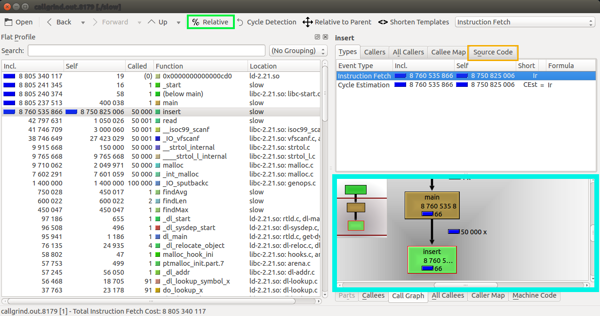

<h1> CS553 Assignment 3: Compiler Tool Demonstration </h1>

<h2> An Introduction to kcachegrind </h2>
In this tutorial you will learn about the profiling visualization tool kcachgrind. This is a profiling tool that can help the user detect bottlenecks in their code. It does this through a GUI that displays myriads of information to the user. It shows things like which functions are running the most, how many instructions are being executed in functions, and a callgraph visualization. These will hopefully lead the user to conclusions on how to optimize their code. You can find the website for the tool [here](https://kcachegrind.github.io/html/Home.html).

<h2> What are callgrind and kcachegrind? </h2>
As stated earlier, kcachegrind visualizes profiling information. The profiling information it uses is generated using the callgrind tool, which uses the valgrind runtime framework and extends the cachegrind tool in order to create call graphs. Essentially, Cachegrind collects flat profile data: event counts (data reads, cache misses, etc.) are attributed directly to the function they occurred in. Callgrind then extends this functionality by propagating costs across function call boundaries. If function foo calls bar, the costs from bar are added into foo's costs. When applied to the program as a whole, this builds up a picture of so called inclusive costs, that is, where the cost of each function includes the costs of all functions it called, directly or indirectly.

<h2> Evaluating a Program Using kcachegrind</h2>
You will find two example files, slow.c and fast.c. We will be running our example on these files. Lets get started.


1. First, make sure you have valgrind installed. You can check if you have valgrind installed by running the command 
```
valgrind --version
```
 If it is uninstalled, you can install it via sudo apt-get install valgrind or by following instructions found [here](http://valgrind.org/downloads/current.html#current).


2. Next, you must install kcachegrind. You can check if you have kcachegrind installed by running the command 
```
kcachegrind --version
```
 If it is uninstalled, you can install it via sudo apt-get install kcachegrindgrind or by following instructions found [here](https://kcachegrind.github.io/html/Download.html).


3. Now we compile our code. We run the following commands (Note the -g option for additional debug information)
```
gcc -g slow.c -o slow
gcc -g fast.c -o fast
``` 
 We now have produced two executables.
 
 
 4. Now we must generate the call graph information about our program. To do this, we run it through the callgrind tool provided by valgrind. Our program requires input, so I have provided an example input file titled input.
 ```
 valgrind --tool=callgrind ./slow < input
 valgrind --tool=callgrind ./fast < input
 ```
  We have now generated our callgraph information, which will be found in a file called callgrind.out.[num]
 
 5. We can now run our information through kcachegrind. For this tutorial, since the user will be working on rose, I will include images of kcachegrind, but the will not be able to run it on rose. At this point, we just need to open our call graph up in kcachegrind. We do so by running
 ```
 kcachegrind trace
 ```
  where trace is the call graph we generated that we want to evaluate.
  
  
  6. We are presented with this interface.
  

